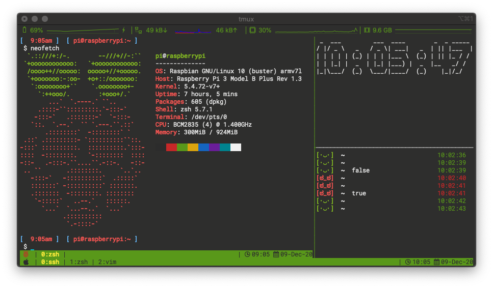

# ARCHIVED
This repository now takes a part of [my new project](https://github.com/pPrecel/dotfiles.fish).

# my-console
This repository contains all themes, plugins, and other configs for my console

# prerequisites
## zsh:
* [oh-my-zsh](https://github.com/ohmyzsh/ohmyzsh)
* [antibody](https://getantibody.github.io/)

## vim:
* [vim](https://github.com/vim/vim) 
* [vim-plug](https://github.com/junegunn/vim-plug)

## tmux:
* [tmux](https://github.com/tmux/tmux)
* [tpm](https://github.com/tmux-plugins/tpm)

## used fonts
* [nerd fonts](https://github.com/ryanoasis/nerd-fonts)

## colors

| clolor | Normal | Bright |
|:------ |:------ |:------ |
| Black  | 2c2c2c | 535353 |
| Red    | c62727 | ef524f |
| Green  | 59981a | 81b622 |
| Yellow | dba40e | ffea3a |
| Blue   | 1564bf | 64b5f6 |
| Magen. | 691e99 | ba67c8 |
| Cyan   | 00828e | 26c6da |
| White  | f2f2f2 | e0e0e0 |

# oh-my-zsh plugins
* [git](https://github.com/ohmyzsh/ohmyzsh/tree/master/plugins/git)
* [iterm2](https://github.com/ohmyzsh/ohmyzsh/tree/master/plugins/iterm2)
* [history](https://github.com/ohmyzsh/ohmyzsh/tree/master/plugins/history)
* [colored-man-pages](https://github.com/ohmyzsh/ohmyzsh/tree/master/plugins/colored-man-pages)
* [kubectl](https://github.com/ohmyzsh/ohmyzsh/tree/master/plugins/kubectl)
* [tmux](https://github.com/ohmyzsh/ohmyzsh/tree/master/plugins/tmux)
* [pPrecel/kyma-zsh](https://github.com/pPrecel/kyma-zsh)
* [hlissner/zsh-autopair](https://github.com/hlissner/zsh-autopair)
* [zsh-users/zsh-autosuggestions](https://github.com/zsh-users/zsh-autosuggestions)
* [vasyharan/zsh-brew-services](https://github.com/vasyharan/zsh-brew-services)
# oh-my-zsh theme
* [pprecel/natural-zsh-theme](https://github.com/pPrecel/natural-zsh-theme)
# vim plugins
* [airblade/vim-gitgutter](https://github.com/airblade/vim-gitgutter)
* [itchyny/lightline.vim](https://github.com/itchyny/lightline.vim)
* [junegunn/fzf](https://github.com/junegunn/fzf)
* [junegunn/fzf.vim](https://github.com/junegunn/fzf.vim)

# tmux plugins
* [pPrecel/tmux-natural](https://github.com/pPrecel/tmux-natural)